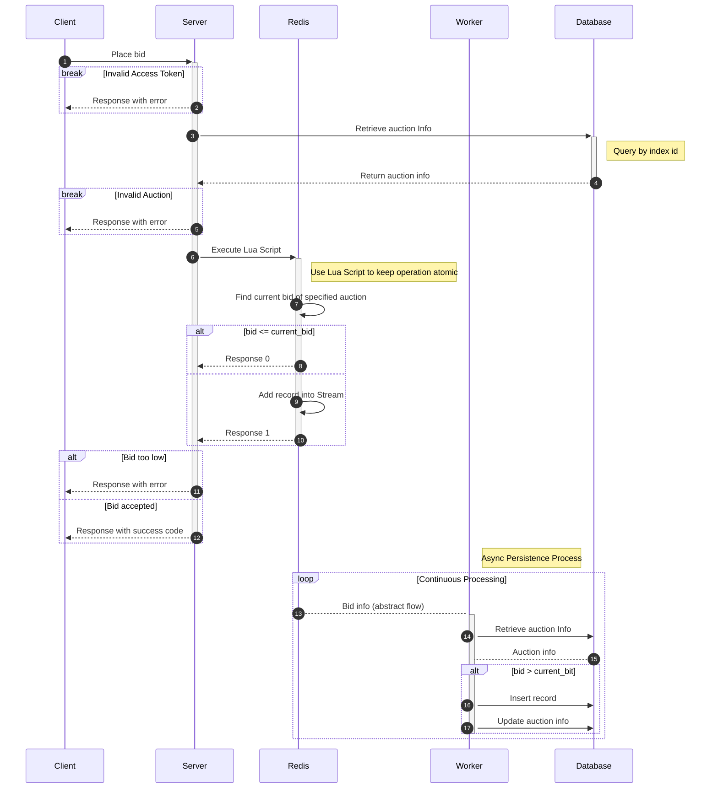

# Q4

[](https://github.com/GreptimeTeam/greptimedb/releases/latest)   

專案的預設目標是分佈式拍賣系統，目的是展示**資料的兢爭處理**和**分佈式架構設計**。

---

## Feature

- 使用 Server-Sent Events (SSE) 實現即時出價通知
- 使用 Redis 實現出價動作的快速回應
- 使用 Redis Stream 實現出價紀錄同步到資料庫
- 使用分布式鎖確保 Redis Stream 內的資料同一時間只有一個 Server 會將出價紀錄進行同步
- 實現自動續期的分布式鎖，保證處理同步作業的 Server 在下線時，快速釋放分布式鎖
- API 提供 Cursor Pagination 的搜尋方式，提升搜尋拍賣商品的效能
- 使用 S3 API 將使用者上傳的圖片儲存到 Cloudflare R2
- 提供 OIDC 的登入方法
- 提供 Dockerfile 和 Helm Chart 方便部署

## Change Log

- v0.7.0 🔄取消出價鎖和兩次的出價嘗試，改成傳入參考值做為預設的當前最高價，避免第二次出價嘗試
- v0.6.1 🐛修正未登入的提示訊息造成 UI 錯誤的問題
- v0.6.0 🆕支援多平台的 SSO 登入，以及基本的用戶管理功能
- v0.5.0 🆕紀錄並限制使用者上傳圖片的頻率
- v0.4.0 🔄改由 Server 產生 JWT，提升 API 處理時驗證使用者身分的速度
- v0.3.3 🐛修正日誌寫入時調用到可能會是空值的當前出價欄位
- v0.3.2 🐛修正新增拍賣時的圖片網址寫入資料庫造成錯誤的問題
- v0.3.1 🐛修正 Helm Chart 中，不同 Helm Release 但會共用 Pod Label 的問題
- v0.3.0 🔄實現異步出價，由 Redis 比價後快速回應使用者，系統再以異步方式同步到資料庫
- v0.2.0 🆕使用 Redis Stream 來同步跨 Server 的出價處理
- v0.1.1 🐛修正 Helm Chart 中 Service 使用 NodePort 多暴露了埠的問題，改為 ClusterIP
- v0.1.0 🆕初版

## Demo Site

- 網站網址：[https://bid-demo-1.yyuk-dev.link](https://bid-demo-1.yyuk-dev.link)
- 系統狀態：
- 使用限制:
  - ⚠️每小時最多上傳 2 張圖片
  - ⚠️上傳的圖片隨時可能被刪除
  - ⚠️Internal SSO Provider 不提供註冊，但能使用 Google 登入

## Prepare

### Database Migration

1. 安裝 Atlas

   請參考[ariga/atlas](https://github.com/ariga/atlas/releases)。

2. 準備 `models/.env`

    ```bash
    npm run setup:models
    ```

    或者

    ```bash
    cp -u ./models/.env.sample ./models/.env
    ```

3. 修改 `models/.env` 內的 `TARGET_DB_DSN`

    :bulb: `DEV_DB_DSN` 變數只有在生成新的 migration 時會需要。

4. 執行遷移

    ```bash
    npm run migrate:prod
    ```

    或者

    ```bash
    export $(grep -v '^#' models/.env | xargs)
    atlas migrate apply -c file://models/atlas.hcl --env gorm
    ```

### Create Redis Stream and Consumer Group

根據需求設定 `<stream>` 和 `<group>`，需要反映到 `.env` 的 `Q4_REDIS_STREAM_KEY_FOR_BID` 和 `Q4_REDIS_CONSUMER_GROUP` 上。

```bash
redis-cli XGROUP CREATE <stream> <group> 0 MKSTREAM
```

也可以使用預設的名稱來建立:

```bash
redis-cli XGROUP CREATE q4-shared-bid-stream q4-bid-group 0 MKSTREAM
```

## Quick Start

### Helm Chart

1. 下載指定版本的 Helm Chart 預設值

    ```bash
    helm show values oci://ghcr.io/ljwun/helm/q4 --version <version> > q4-helm-chart-value.yaml
    ```

2. 修改 `q4-helm-chart-value.yaml`

3. 使用修改的設定檔來安裝指定版本的 Q4

    ```bash
    helm install my-release oci://ghcr.io/ljwun/helm/q4 --version <version> -f q4-helm-chart-value.yaml
    ```

### Docker

1. 下載專案

    ```bash
    git clone --depth 1 --branch <version> https://github.com/ljwun/Q4.git
    cd ./Q4
    ```

2. 準備設定檔

    :bulb: 以下指令會產生三個預設設定檔 `./.env`  `./ui/.env`  `./models/.env`

    ```bash
    npm run setup:all
    ```

3. 修改設定檔 `./.env` 和 `./ui/.env`

4. 準備 docker-compose

    :bulb: 需要配合實際狀況修改 `<service port>` 和 `<service ip>` 。

    ```yaml
    services:
      ui:
        image: ghcr.io/ljwun/q4-ui:latest
        build:
          context: ../../
          dockerfile: .ci/ui.Dockerfile
        ports:
          - "<service port>:3000"
        env_file:
          - ../../ui/.env
        environment:
          - HOSTNAME=0.0.0.0
          - PORT=3000
          - Q4_FRONTEND_BASE_URL=http://<service ip>:<service port>/
          - Q4_BACKEND_BASE_URL=http://api:8080/
        depends_on:
          - api
        networks:
          - q4-network
      api:
        image: ghcr.io/ljwun/q4-api:latest
        build:
          context: ../../
          dockerfile: .ci/api.Dockerfile
        env_file:
          - ../../.env
        environment:
          - Q4_SERVER_URL=0.0.0.0:8080
        networks:
          - q4-network
    networks:
      q4-network:
        driver: bridge
    ```

5. 啟動服務

    ```bash
    docker compose up -d
    ```

### Local

1. 下載專案

    ```bash
    git clone --depth 1 --branch <version> https://github.com/ljwun/Q4.git
    cd ./Q4
    ```

2. 安裝依賴

    ```bash
    npm run install:all
    ```

3. 準備設定檔

    :bulb: 以下指令會產生三個預設設定檔 `./.env`  `./ui/.env`  `./models/.env`

    ```bash
    npm run setup:all
    ```

4. 修改設定檔 `./.env` 和 `./ui/.env`

5. 啟動 api server 和 ui server

    ```bash
    npm run start:all
    ```

### Vscode Debug

1. 下載專案

    ```bash
    git clone --depth 1 --branch <version> https://github.com/ljwun/Q4.git
    cd ./Q4
    ```

2. 安裝依賴

    ```bash
    npm run install:all
    ```

3. 準備設定檔

    :bulb: 以下指令會產生三個預設設定檔 `./.env`  `./ui/.env`  `./models/.env`

    ```bash
    npm run setup:all
    ```

4. 修改設定檔 `./.env` 和 `./ui/.env`

5. 使用 VSCode 開啟專案

    ```bash
    code .
    ```

6. 在 VSCode 中按下 `Ctrl+Shift+D` 或點選左側 `Run and Debug` 圖示

7. 在下拉選單中選擇 `Server 1`，然後點選開始按鈕執行

    :bulb: 啟動後可以在 Debug Console 中看到 `api server 1` 和 `ui server 1` 的 log

## Mechanism

出價功能最初是透過[類似樂觀鎖的做法](https://github.com/ljwun/Q4/blob/20737a3ec418a20c59469ae40bb03a2fc6355e67/api/server.go#L259)來實現出價的功能，後來則是考慮極端流量的情況，以及出價紀錄的順序問題，進一步改成目前的 Redis 同步比價、Redis Stream 異步紀錄到資料庫的方案。



在接收到出價請求後，系統會依序先驗證**身分**和**現在是否可出價**，接下來透過 Lua Script 交由 Redis 利用 Redis 上的最高出價紀錄來跟使用者的出價金額進行比較，成功的出價會進一步被寫入 Redis Stream 中並返回，系統接著根據 Lua Script 的結果回應給客戶端，到此使用者的出價行為就完成了。

Redis Stream 的出價資料則會由系統以異步的方式寫回資料庫，考慮到分布式部屬的情況會有多個實例，以及負責處理的實例意外下線的情況，引入分布式鎖來決定每次交由哪個實例來進行處理，同時在取得鎖後先讀取 PENDING 狀態的資料，確保因為前一個處理的實例下線時沒有完成同步的出價紀錄也能再次進行同步，確保順序性和完整性，這部分也就是上面循序圖的**13**。

## License

本專案採用 [Apache License 2.0](LICENSE) 授權。任何人都可以自由使用、修改和分發本程式碼，但必須保留原始版權聲明並標明修改。

詳細條款請參閱 [LICENSE](LICENSE) 檔案。
